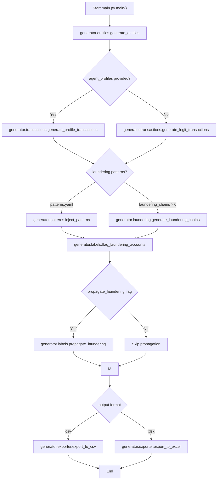

# Program Flowchart

```mermaid
flowchart TD
    A["Start main.py main()"] --> B["generator.entities.generate_entities"]
    B --> C{"agent_profiles provided?"}
    C -->|Yes| D["generator.transactions.generate_profile_transactions"]
    C -->|No| E["generator.transactions.generate_legit_transactions"]
    D --> F
    E --> F
    F{"laundering patterns?"}
    F -->|patterns.yaml| G["generator.patterns.inject_patterns"]
    F -->|laundering_chains > 0| H["generator.laundering.generate_laundering_chains"]
    G --> I["generator.labels.flag_laundering_accounts"]
    H --> I
    I --> J{"propagate_laundering flag"}
    J -->|Yes| K["generator.labels.propagate_laundering"]
    J -->|No| L["Skip propagation"]
    K --> M
    L --> M
    M --> N{"output format"}
    N -->|csv| O["generator.exporter.export_to_csv"]
    N -->|xlsx| P["generator.exporter.export_to_excel"]
    O --> Q["End"]
    P --> Q
```
