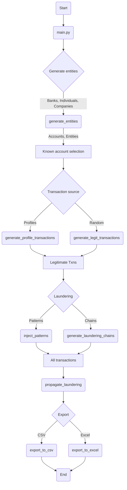

# Function Flowchart

```mermaid
flowchart TD
    A(Start) --> B(main.py)
    B --> C{Generate entities}
    C -->|Banks, Individuals, Companies| D(generate_entities)
    D -->|Accounts, Entities| E[Known account selection]
    E --> F{Transaction source}
    F -->|Profiles| G(generate_profile_transactions)
    F -->|Random| H(generate_legit_transactions)
    G --> I[Legitimate Txns]
    H --> I
    I --> J{Laundering}
    J -->|Patterns| K(inject_patterns)
    J -->|Chains| L(generate_laundering_chains)
    K --> M[All transactions]
    L --> M
    M --> N(propagate_laundering)
    N --> O{Export}
    O -->|CSV| P(export_to_csv)
    O -->|Excel| Q(export_to_excel)
    P --> R(End)
    Q --> R
```
